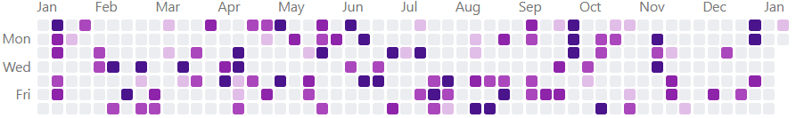

# Activity Grid

A customizable activity grid component that creates GitHub-style contribution graphs. This web component allows you to visualize activity data over time with support for various themes, configurations, and interaction options.

[](https://badge.fury.io/js/activity-grid)
[](https://opensource.org/licenses/MIT)


## Live Examples

Interactive examples are available on StackBlitz:

[](https://stackblitz.com/edit/vitejs-vite-tgbgx7fx?file=README.md)
[](https://stackblitz.com/edit/vitejs-vite-cbqzbems?file=README.md)
[](https://stackblitz.com/edit/stackblitz-starters-bbdylzzz?file=package.json)
[](https://stackblitz.com/edit/vitejs-vite-ow4jjek6?file=package.json)

## Features

- 📊 GitHub-style activity visualization
- 🎨 Multiple built-in color themes (green, blue, red, yellow, purple)
- 🌓 Dark mode support
- 📅 Flexible date range configuration
- 🗓️ Customizable week display (start on Monday, skip weekends)
- 🎯 Interactive cells with click events
- 💪 TypeScript support
- 🔌 Framework agnostic - works with any frontend framework

## Installation

```bash
npm install activity-grid
```

## Basic Usage

```html
<!-- In your HTML -->
<activity-grid id="myGrid"></activity-grid>

<script>
  // Initialize with data
  const grid = document.getElementById('myGrid');
  grid.data = [
    { date: '2024-01-01', count: 5 },
    { date: '2024-01-02', count: 2 },
    // ... more data
  ];
</script>
```

```typescript
// If using TypeScript/ES modules
import 'activity-grid';
```

## Data Format

The component accepts an array of activity data points with the following structure:

```typescript
interface ActivityData {
  /** Date in YYYY-MM-DD format */
  date: string;
  /** Number of activities for this date (must be non-negative) */
  count: number;
  /** Optional identifier for the cell */
  id?: string;
}
```

## Configuration Options

The component can be configured with the following attributes/properties:

| Property | Type | Default | Options | Description |
|----------|------|---------|----------|-------------|
| `data` | `ActivityData[]` | `[]` | - | Array of activity data points |
| `colorTheme` | `string` | `'green'` | `'green'`, `'red'`, `'blue'`, `'yellow'`, `'purple'` | Predefined color theme for the grid |
| `colors` | `string[]` | `['#ebedf0', '#9be9a8', '#40c463', '#30a14e', '#216e39']` | Any array of 5 valid CSS colors | Custom color array for activity levels |
| `emptyColor` | `string` | Light mode: `'#ebedf0'`<br>Dark mode: `'#161b22'` | Any valid CSS color | Color for days with no activity |
| `darkMode` | `boolean` | `false` | `true`, `false` | Whether to use dark mode colors |
| `skipWeekends` | `boolean` | `false` | `true`, `false` | Whether to exclude weekends from the grid |
| `startWeekOnMonday` | `boolean` | `false` | `true`, `false` | Whether to start weeks on Monday instead of Sunday |
| `startDate` | `string` | One year before end date | Any valid date in `YYYY-MM-DD` format | Start date for the activity grid |
| `endDate` | `string` | Current date | Any valid date in `YYYY-MM-DD` format | End date for the activity grid |

### ActivityData Interface

```typescript
interface ActivityData {
  /** Date in YYYY-MM-DD format */
  date: string;
  /** Number of activities for this date (must be non-negative) */
  count: number;
  /** Optional identifier for the cell */
  id?: string;
}
```

## Examples

### Color Themes

The activity grid comes with several built-in themes:

#### Default (Green)
```html
<activity-grid></activity-grid>
```


#### Blue Theme
```html
<activity-grid color-theme="blue"></activity-grid>
```


#### Red Theme
```html
<activity-grid color-theme="red"></activity-grid>
```


#### Yellow Theme
```html
<activity-grid color-theme="yellow"></activity-grid>
```


#### Purple Theme
```html
<activity-grid color-theme="purple"></activity-grid>
```


#### Custom Colors
```html
<activity-grid colors='["#ebedf0", "#9be9a8", "#40c463", "#30a14e", "#216e39"]'></activity-grid>
```


### Week Configuration

```html
<!-- Start week on Monday -->
<activity-grid start-week-on-monday></activity-grid>

<!-- Skip weekends -->
<activity-grid skip-weekends></activity-grid>
```

### Dark Mode

```html
<activity-grid dark-mode></activity-grid>
```


### Custom Date Range

```html
<activity-grid 
  start-date="2024-01-01" 
  end-date="2024-12-31">
</activity-grid>
```


### Handling Click Events

```javascript
const grid = document.querySelector('activity-grid');
grid.addEventListener('cell-click', (event) => {
  const { date, count, id } = event.detail;
  console.log(`Cell clicked: ${date} with ${count} activities`);
});
```

## Framework Integration

### React

```tsx
import 'activity-grid';
import { useEffect, useRef } from 'react';

declare global {
  namespace JSX {
    interface IntrinsicElements {
      'activity-grid': any;
    }
  }
}

function ActivityGridComponent() {
  const gridRef = useRef(null);

  useEffect(() => {
    if (gridRef.current) {
      gridRef.current.data = [
        { date: '2024-01-01', count: 5 },
        // ... more data
      ];
    }
  }, []);

  return <activity-grid ref={gridRef} dark-mode></activity-grid>;
}
```

### Vue

```vue
<template>
  <activity-grid ref="grid" dark-mode></activity-grid>
</template>

<script setup lang="ts">
import 'activity-grid';
import { onMounted, ref } from 'vue';

const grid = ref();

onMounted(() => {
  grid.value.data = [
    { date: '2024-01-01', count: 5 },
    // ... more data
  ];
});
</script>
```

More framework examples coming soon!

## Browser Support

The component works in all modern browsers that support Web Components:
- Chrome/Edge (Chromium-based)
- Firefox
- Safari

## Contributing

Contributions are welcome! Please feel free to submit a Pull Request.

## License

This project is licensed under the MIT License - see the [LICENSE](LICENSE) file for details.
